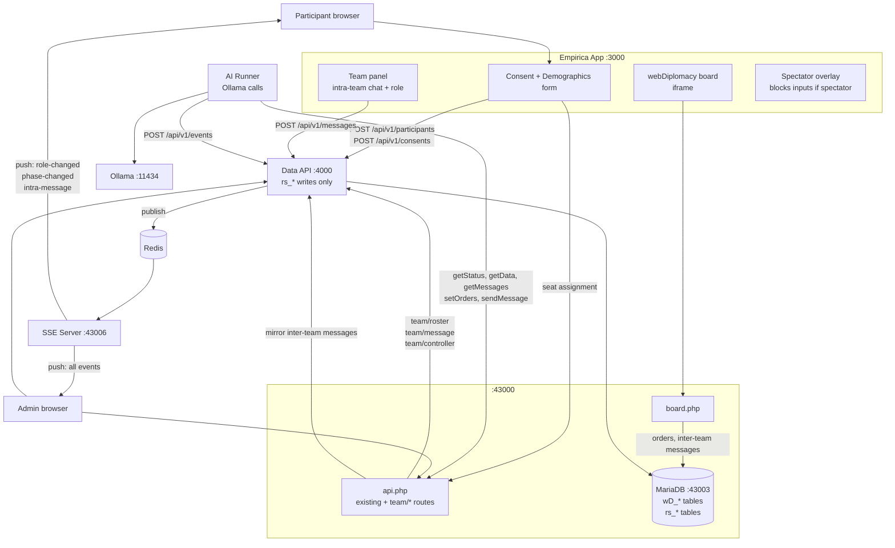

# System Architecture — webDiplomacy × Empirica Research Platform

> Last updated: 2026-07-01. Single source of truth for service topology, data flow, and design decisions.
> Contracts live in [`docs/contracts/UNIVERSAL_CONTRACT.md`](./contracts/UNIVERSAL_CONTRACT.md).

---

## Services

| Service | Tech | Container | Port | Responsibility |
|---|---|---|---|---|
| **webDiplomacy** | PHP 8.1 + nginx | `webserver`, `php-fpm` | 43000 | Game engine, adjudicator, board UI, `api.php` REST surface |
| **Data API** | Node.js 18 (Express) | `data-api` | 4000 | **NEW** — unified research event store; only service that writes to `rs_*` tables |
| **AI Runner** | Node.js 18 (ESM) | process (no container) | — | Polls game state, calls Ollama, submits orders/messages, POSTs events to Data API |
| **Empirica App** | React (Empirica framework) | process / container | 3000 | Participant UI shell — consent form, team panel, intra-team chat, board iframe |
| **SSE Server** | Node.js | `sse` | 43006 | Real-time push events to browsers (role changes, phase transitions) |
| **Database** | MariaDB 10 | `db` | 43003 | Stores both `wD_*` (game data) and `rs_*` (research data) |
| **Redis** | Redis 7 | `redis` | 6379 | SSE event bus; session cache |
| **Ollama** | External process | — | 11434 | Local LLM inference (llama3 or configured model) |

### What does NOT change
- webDiplomacy PHP core: adjudicator, order processing, game state, `wD_*` tables — **untouched**.
- webDiplomacy `api.php` routes: all existing 7 routes stay as-is. New team routes are additive.
- SSE server: unchanged except it listens for new event types from Redis.

---

## System diagram



---

## Data flow — key user journeys

### 1. Participant joins
```
Browser → Empirica Intro form
  → POST /api/v1/participants        (Data API — create participant)
  → POST /api/v1/consents            (Data API — save legal consent)
  → GET  api.php?route=team/roster   (webDiplomacy — find open seat)
  → POST /api/v1/teams/:id/members   (Data API — assign to team)
  → POST /api/v1/events (team.assigned)
  → SSE: participant-joined          (broadcast to team)
  → Empirica Stage rendered (board iframe + team panel)
```

### 2. Human submits orders (controller)
```
Human interacts with board.php iframe (unchanged webDiplomacy flow)
  → wD_Orders row saved (by PHP, unchanged)
  → AI runner polls getStatus, sees new orders → mirrors to Data API
  → POST /api/v1/events (order.submitted)
```

### 3. AI acts
```
AI Runner tick (every POLL_SECONDS):
  → GET api.php?route=game/status
  → GET api.php?route=game/data
  → GET api.php?route=game/getmessages
  → Ollama /api/generate (llama3)
  → POST api.php?route=game/orders
  → POST api.php?route=game/sendmessage
  → POST /api/v1/events (ai.decision)   (Data API)
```

### 4. Intra-team message
```
Team member types in Empirica TeamPanel
  → POST /api/v1/messages { scope: "intra", ... }   (Data API)
  → Data API publishes to Redis
  → SSE server pushes intra-message event to all team members
  → TeamPanel updates in all browsers
  (Never touches webDiplomacy)
```

### 5. Admin reassigns controller
```
Admin panel → PATCH /api/v1/teams/:id/controller
  → Data API updates rs_team_members
  → POST /api/v1/events (role.changed)
  → Data API publishes to Redis
  → SSE pushes role-changed to all team members
  → Old controller's board iframe gets spectator overlay
  → New controller's overlay is removed
```

---

## Configuration

### `.env` additions (beyond existing)
```
# Data API
DATA_API_URL=http://localhost:4000
DATA_API_KEY=<internal service token — never commit>
DATA_API_PORT=4000

# DB provider (Data API reads this)
DATA_PROVIDER=mysql          # mysql | postgres | supabase

# Consent form version — bump this string when form text changes
CONSENT_FORM_VERSION=1.0

# SSE
SSE_SECRET=<shared with config.php>
```

### `config/empirica.json` (new fields vs sample)
```jsonc
{
  "variantID": 1,
  "consentFormVersion": "1.0",
  "globalIntraTeamChat": true,
  "teams": {
    "England": {
      "maxHumans": 3,
      "bots": 0,
      "intraTeamChat": true,
      "controller": "auto",
      "ai": { "provider": "ollama", "model": "llama3" }
    }
  }
}
```

---

## Design decisions & rationale

| Decision | Rationale |
|---|---|
| Data API as separate service | Single point to swap DB (mysql → postgres → supabase) without touching PHP, AI runner, or React code |
| `rs_*` tables alongside `wD_*` | No risk to game integrity; research schema is additive; same DB container = no network hop for joins |
| webDiplomacy board in iframe | Zero changes to PHP core required; spectator mode handled by Empirica overlay, not PHP |
| Intra-team chat in Empirica, not webDiplomacy | webDiplomacy press is country-to-country; intra-team is same-country communication — different concept |
| SSE for real-time, Redis as bus | Already in stack; avoids adding WebSocket infrastructure |
| AI runner stays a process, not a container | Simple to spawn N runners per game; no orchestration overhead |
| 1 bot → webDiplomacy native bot | No Ollama overhead for single-bot case; native bot is well-tested |

---

## File map

```
docs/
  ARCHITECTURE.md                  ← this file
  contracts/
    UNIVERSAL_CONTRACT.md          ← all API contracts, auth, rate limits
    DATA_SCHEMA.md                 ← all DB table definitions
    EVENT_SCHEMA.md                ← all event type payloads
  tasks/
    TASK_1_DATA_API.md
    TASK_2_TEAM_SYSTEM.md
    TASK_3_CONSENT_FORM.md
    TASK_4_UI_LAYOUT.md
    TASK_5_INTRA_TEAM_CHAT.md
    TASK_6_BOT_STRATEGY.md
    TASK_7_ADMIN_CONTROLS.md    ← researcher dashboard + admincp.php game config tab
  empirica-integration/
    README.md                      ← superseded by ARCHITECTURE.md
    API_CONTRACT.md                ← superseded by contracts/UNIVERSAL_CONTRACT.md
    SETUP.md                       ← superseded by root README.md
```
