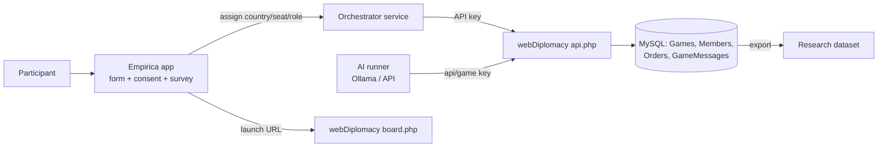

# Empirica + webDiplomacy Integration Plan

This document plans integrating [Empirica](https://empirica.ly) as the recruitment / onboarding /
experiment layer in front of webDiplomacy, plus configurable AI players, 2-player teams, and full
research data capture (every move and every message).

## Goal flow

1. Participant enters **Empirica** (recruitment, consent, demographic / pre-game form).
2. Empirica assigns them to a game + a country (and, for 2-player teams, a seat + role).
3. Empirica redirects/embeds them into the webDiplomacy board to play.
4. webDiplomacy captures all moves and dialog for research; Empirica captures survey + treatment data.

## Architecture overview

- **Empirica** stays the front door: forms, consent, treatments, surveys.
- An **orchestrator** maps each Empirica participant to a webDiplomacy game + country, using the
  existing API (`api.php`) and admin tooling instead of forking the PHP core.
- **AI runner** is a small Node service that calls the same API to submit orders/messages for any
  country flagged as AI, configurable between local Ollama and remote API.
- Data collection rides on existing tables (`wD_Orders`, `wD_GameMessages`) — no schema changes
  required for capture, only export.

## Game setup model (configurable)

Each country (the "team") can be configured as:

| Mode | Seat A | Seat B | Decision maker |
| --- | --- | --- | --- |
| Solo human | human | — | A |
| Both human | human | human | one of A/B |
| Both AI | AI | AI | one of A/B |
| Mixed | human | AI | configured |

- Up to **2 players per team**, exactly **1 decision maker** whose orders are authoritative.
- AI per seat: `local` (Ollama model) or `api` (external LLM). Model, endpoint, and prompt are
  config-driven so any country can be swapped human↔AI without code changes.

webDiplomacy natively maps 1 user → 1 country. The second seat + decision-maker rule is layered on
top via the orchestrator and team config (see `config/empirica.sample.json`), not by rewriting the
adjudicator.

## Hook points in this repo

- `api.php` — `SetOrders` (`game/orders`), game state, members; key-based external control. AI and
  orchestrator submit here.
- `botgamecreate.php` / `wD_BotGameQueue` — existing bot-game queue to model AI-vs-human seating.
- `gamecreate.php` (`newGame[...]`) — game creation parameters for the orchestrator.
- `wD_Orders`, `wD_GameMessages` — already store every move + chat for research export.
- `admincp.php` / `admin/` — admin assigns AI to teams.

## Phases

1. Config & schema: `config/empirica.sample.json`, team/seat/role tracking, AI flag per country.
2. Orchestrator: create game, assign countries, generate Empirica launch URLs, issue API keys.
3. AI runner: poll game state, decide via Ollama/API, submit orders + messages, configurable per seat.
4. Data export: dump orders + messages + Empirica survey to a research dataset.
5. Empirica app: form → assignment → redirect to board.

## Data collected for research

- Every order (`wD_Orders`) and dialog message (`wD_GameMessages`) — already persisted.
- Seat/role, AI vs human, model used, decision timing (add via orchestrator log).
- Empirica pre/post forms and treatment assignment.

See [SETUP.md](SETUP.md) for environment variables, APIs, and step-by-step setup.
